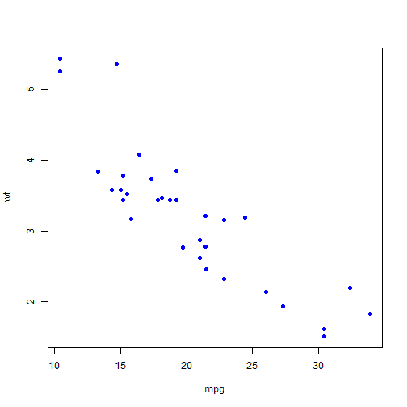

## Car Afficianado's MPG Analyzer

The quest to build the most fuel efficient car

Ken Kaufman
CEO, Car Afficianado

--- .class #id 

## Executive Summary

With ever increasing fuel efficiency standards, automobile designers are looking for innovative ways to build more fuel efficient cars.

Car Afficanado has developed an application to help the engineers build the most efficient car.  The application will help analyze variables that contribute greatly to fuel efficiency.  In addition, the engineer can input variables and instantly see the predicted MPG.

--- .class #id 

## Automobile Variables

The variables explored in this application include:


```r
data(mtcars)
names(mtcars)
```

```
##  [1] "mpg"  "cyl"  "disp" "hp"   "drat" "wt"   "qsec" "vs"   "am"   "gear"
## [11] "carb"
```

--- .class #id 

## Example Analysis


```r
plot(mtcars$mpg, mtcars$wt, pch = 16, col="blue", xlab="mpg", ylab="wt")
```

 

--- .class #id 

## Predicting the MPG

A prediction model has been built to deliver 90+% accuracy.  It allows the engineer to alter a variety of highly impactful variables and see the impacts to MPG instantly.


